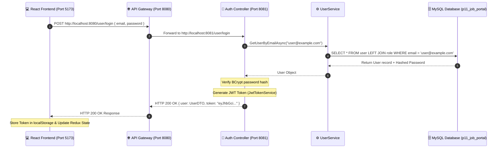

# 📘 Comprehensive Guide to `.NET 8` Backend Architecture & Codebase

Welcome to .NET 8! If you are new to C# and .NET, this document will serve as your complete handbook. It breaks down **how .NET works**, **the overall architecture**, **every single file line-by-line**, and **how data flows through the application**.

---

## 📑 Table of Contents
1. [Core Concepts: Solution, Projects, & Architecture](#1-core-concepts-solution-projects--architecture)
2. [Project Folder & File Structure](#2-project-folder--file-structure)
3. [Building Block: `JobPortal.Shared`](#3-building-block-jobportalshared)
   - [Entities: `Role.cs` & `User.cs`](#entities-rolecs--usercs)
   - [DTOs (Data Transfer Objects)](#dtos-data-transfer-objects)
   - [Database Context: `JobPortalDbContext.cs`](#database-context-jobportaldbcontextcs)
   - [JWT Token Generator: `JwtTokenService.cs`](#jwt-token-generator-jwttokenservicecs)
4. [Microservice: `JobPortal.AuthService`](#4-microservice-jobportalauthservice)
   - [`Program.cs`: The Entry Point & Pipeline](#programcs-the-entry-point--pipeline-authservice)
   - [`Services/UserService.cs`: Business Logic & Database Queries](#servicesuserservicecs-business-logic--database-queries)
   - [`Controllers/UserController.cs`: HTTP API Endpoints](#controllersusercontrollercs-http-api-endpoints)
5. [Entry Point: `JobPortal.ApiGateway`](#5-entry-point-jobportalapigateway)
   - [`Program.cs` & `appsettings.json` (YARP Proxy)](#programcs--appsettingsjson-yarp-proxy)
6. [Step-by-Step Request Execution Flow](#6-step-by-step-request-execution-flow)

---

## 1. Core Concepts: Solution, Projects, & Architecture

### What is a `.sln` (Solution) and `.csproj` (Project)?
- **Solution (`JobPortal.sln`)**: Think of a solution as a container or folder workspace. It groups multiple related projects together so you can build them all at once.
- **Project (`.csproj`)**: An individual compiled unit (like a library or a web application).
  - `JobPortal.Shared.csproj` -> A **Class Library** (`classlib`), meant to be shared by other projects.
  - `JobPortal.AuthService.csproj` -> A **Web API** application.
  - `JobPortal.ApiGateway.csproj` -> A **Web Gateway** proxy application.

### Why Microservices & Shared Layer?
Instead of putting all code in one huge project, we split it into clean layers:
1. **`Shared`**: Contains database models, JWT logic, and shared request/response models.
2. **`AuthService`**: Handles user accounts, passwords, login, and registration. Runs independently on **Port 8081**.
3. **`ApiGateway`**: The single entrance for frontend clients. Runs on **Port 8080** and routes incoming HTTP traffic to the appropriate backend service.

---

## 2. Project Folder & File Structure

```text
Job-Portal/backend-dotnet/
├── JobPortal.sln                                # Solution file
│
├── BuildingBlocks/
│   └── JobPortal.Shared/                        # Shared Class Library
│       ├── Entities/
│       │   ├── Role.cs                          # Role Database Table Model
│       │   └── User.cs                          # User Database Table Model
│       ├── DTOs/
│       │   ├── UserRegisterDTO.cs               # Registration Request Payload
│       │   ├── LoginRequestDTO.cs                # Login Request Payload
│       │   ├── UserDTO.cs                       # User Response Model (hides password)
│       │   └── LoginResponse.cs                 # Login Response Model (UserDTO + Token)
│       ├── Data/
│       │   └── JobPortalDbContext.cs            # EF Core Database Connection & Mapping
│       └── Services/
│           └── JwtTokenService.cs               # Generates JSON Web Tokens (JWT)
│
├── Services/
│   └── JobPortal.AuthService/                   # Authentication Web API (Port 8081)
│       ├── Controllers/
│       │   └── UserController.cs                # HTTP API Routes (/user/login, /user/register, etc.)
│       ├── Services/
│       │   └── UserService.cs                   # Business Logic & DB Operations
│       ├── appsettings.json                     # DB Connection String & App Config
│       └── Program.cs                           # App Startup & Dependency Injection Setup
│
└── ApiGateway/
    └── JobPortal.ApiGateway/                    # YARP API Gateway (Port 8080)
        ├── appsettings.json                     # Proxy Route Configurations
        └── Program.cs                           # Gateway Entry Point
```

---

## 3. Building Block: `JobPortal.Shared`

### Entities: `Role.cs` & `User.cs`

Entities represent your SQL Database tables in C# code using **Entity Framework Core (EF Core)**.

#### `Role.cs`
```csharp
using System.ComponentModel.DataAnnotations;
using System.ComponentModel.DataAnnotations.Schema;

namespace JobPortal.Shared.Entities;

[Table("role")] // 👈 Tells EF Core this class maps to the MySQL table named 'role'
public class Role
{
    [Key] // 👈 Marks this field as the Primary Key
    [Column("rid")] // 👈 Maps this property to the SQL column 'rid'
    public int Rid { get; set; }

    [Required] // 👈 NOT NULL constraint in SQL
    [MaxLength(50)] // 👈 VARCHAR(50) limit
    [Column("rname")] // 👈 Maps to SQL column 'rname'
    public string Rname { get; set; } = string.Empty;
}
```

#### `User.cs`
```csharp
using System;
using System.ComponentModel.DataAnnotations;
using System.ComponentModel.DataAnnotations.Schema;

namespace JobPortal.Shared.Entities;

[Table("user")] // 👈 Maps to the MySQL table named 'user'
public class User
{
    [Key]
    [Column("uid")]
    public int Uid { get; set; }

    [Column("rid")]
    public int Rid { get; set; } // Foreign key to Role table

    [Required]
    [MaxLength(100)]
    [Column("name")]
    public string Name { get; set; } = string.Empty;

    [Required]
    [MaxLength(100)]
    [Column("email")]
    public string Email { get; set; } = string.Empty;

    [Required]
    [MaxLength(15)]
    [Column("phone")]
    public string Phone { get; set; } = string.Empty;

    [Required]
    [MaxLength(255)]
    [Column("password")]
    public string Password { get; set; } = string.Empty; // BCrypt Hashed Password

    [MaxLength(255)]
    [Column("address")]
    public string? Address { get; set; } // Nullable (?) string

    [Column("city")]
    public int City { get; set; }

    [Column("state")]
    public int State { get; set; }

    [Required]
    [MaxLength(50)]
    [Column("country")]
    public string Country { get; set; } = string.Empty;

    [MaxLength(255)]
    [Column("image")]
    public string? Image { get; set; }

    [MaxLength(20)]
    [Column("status")]
    public string Status { get; set; } = "Active";

    [Column("createdat")]
    public DateTime CreatedAt { get; set; } = DateTime.UtcNow;

    [ForeignKey("Rid")] // 👈 Defines relationship between User and Role
    public Role? Role { get; set; }
}
```

---

### DTOs (Data Transfer Objects)

#### Why do we use DTOs instead of Entities?
- **Security**: Never expose sensitive fields like `Password` or password hashes in API responses!
- **Payload Control**: Allows receiving only the exact fields needed from the frontend.

1. **`UserRegisterDTO.cs`**: Carries incoming user registration fields (`Name`, `Email`, `Password`, `Phone`, `Address`, `City`, `State`, `Country`, `Rid`).
2. **`LoginRequestDTO.cs`**: Carries `{ email, password }` submitted during login.
3. **`UserDTO.cs`**: Clean object sent back to the frontend containing user info **without** sensitive password data.
4. **`LoginResponse.cs`**: Combines `UserDTO` + `Token` (JWT string) into a single response object for the React app.

---

### Database Context: `JobPortalDbContext.cs`

`JobPortalDbContext` acts as the bridge between your C# code and your MySQL database (`p11_job_portal`).

```csharp
using Microsoft.EntityFrameworkCore;
using JobPortal.Shared.Entities;

namespace JobPortal.Shared.Data;

public class JobPortalDbContext : DbContext
{
    // Constructor receiving options (e.g. database connection string)
    public JobPortalDbContext(DbContextOptions<JobPortalDbContext> options) : base(options)
    {
    }

    // DbSets represent queryable database tables
    public DbSet<User> Users => Set<User>();
    public DbSet<Role> Roles => Set<Role>();

    // Advanced mapping & relationship configuration
    protected override void OnModelCreating(ModelBuilder modelBuilder)
    {
        base.OnModelCreating(modelBuilder);

        modelBuilder.Entity<User>(entity =>
        {
            entity.HasKey(e => e.Uid);
            entity.HasIndex(e => e.Email).IsUnique(); // Ensures Email is unique in DB
            entity.HasIndex(e => e.Phone).IsUnique(); // Ensures Phone is unique in DB

            // Specifies One-to-Many relationship between Role and User
            entity.HasOne(e => e.Role)
                  .WithMany()
                  .HasForeignKey(e => e.Rid);
        });

        modelBuilder.Entity<Role>(entity =>
        {
            entity.HasKey(e => e.Rid);
            entity.HasIndex(e => e.Rname).IsUnique();
        });
    }
}
```

---

### JWT Token Generator: `JwtTokenService.cs`

Generates signed JSON Web Tokens (JWT) after a successful login.

```csharp
using System.IdentityModel.Tokens.Jwt;
using System.Security.Claims;
using System.Text;
using Microsoft.IdentityModel.Tokens;
using JobPortal.Shared.Entities;

namespace JobPortal.Shared.Services;

public class JwtTokenService
{
    private readonly string _secretKey;

    public JwtTokenService(string secretKey = "mysecretkeymysecretkeymysecretkey123456")
    {
        _secretKey = secretKey;
    }

    public string GenerateToken(User user)
    {
        var tokenHandler = new JwtSecurityTokenHandler();
        var key = Encoding.UTF8.GetBytes(_secretKey);

        // Claims are key-value pairs stored INSIDE the encrypted JWT token
        var claims = new List<Claim>
        {
            new Claim(ClaimTypes.NameIdentifier, user.Uid.ToString()),
            new Claim(ClaimTypes.Name, user.Email),
            new Claim(ClaimTypes.Email, user.Email),
            new Claim(ClaimTypes.Role, user.Role?.Rname ?? "USER"),
            new Claim(JwtRegisteredClaimNames.Sub, user.Email)
        };

        var tokenDescriptor = new SecurityTokenDescriptor
        {
            Subject = new ClaimsIdentity(claims),
            Expires = DateTime.UtcNow.AddHours(1), // Token valid for 1 hour
            SigningCredentials = new SigningCredentials(
                new SymmetricSecurityKey(key), 
                SecurityAlgorithms.HmacSha256Signature // Secure HMAC-SHA256 signature
            )
        };

        var token = tokenHandler.CreateToken(tokenDescriptor);
        return tokenHandler.WriteToken(token); // Returns string token e.g. "eyJhbGciOiJI..."
    }
}
```

---

## 4. Microservice: `JobPortal.AuthService`

### `Program.cs`: The Entry Point & Pipeline (AuthService)

`Program.cs` configures services (**Dependency Injection**) and request handling (**Middleware**).

```csharp
using System.Text;
using Microsoft.AspNetCore.Authentication.JwtBearer;
using Microsoft.EntityFrameworkCore;
using Microsoft.IdentityModel.Tokens;
using JobPortal.AuthService.Services;
using JobPortal.Shared.Data;
using JobPortal.Shared.Services;

var builder = WebApplication.CreateBuilder(args);

// 1. Tell Kestrel Web Server to listen on Port 8081
builder.WebHost.UseUrls("http://localhost:8081");

// 2. Connect EF Core to MySQL Database using connection string from appsettings.json
var connectionString = builder.Configuration.GetConnectionString("DefaultConnection");
builder.Services.AddDbContext<JobPortalDbContext>(options =>
    options.UseMySql(connectionString, ServerVersion.AutoDetect(connectionString)));

// 3. Register custom Services for Dependency Injection (DI)
builder.Services.AddScoped<UserService>();       // New instance created per HTTP request
builder.Services.AddSingleton<JwtTokenService>(); // Single instance reused across app lifetime

// 4. Configure JWT Authentication Validation rules
var jwtSecret = builder.Configuration["JwtSettings:Secret"] ?? "mysecretkeymysecretkeymysecretkey123456";
var key = Encoding.UTF8.GetBytes(jwtSecret);

builder.Services.AddAuthentication(options =>
{
    options.DefaultAuthenticateScheme = JwtBearerDefaults.AuthenticationScheme;
    options.DefaultChallengeScheme = JwtBearerDefaults.AuthenticationScheme;
})
.AddJwtBearer(options =>
{
    options.RequireHttpsMetadata = false;
    options.SaveToken = true;
    options.TokenValidationParameters = new TokenValidationParameters
    {
        ValidateIssuerSigningKey = true,
        IssuerSigningKey = new SymmetricSecurityKey(key),
        ValidateIssuer = false,
        ValidateAudience = false,
        ClockSkew = TimeSpan.Zero
    };
});

// 5. Allow CORS (Cross-Origin Resource Sharing) so React frontend on port 5173 can make requests
builder.Services.AddCors(options =>
{
    options.AddPolicy("AllowFrontend", policy =>
    {
        policy.AllowAnyOrigin()
              .AllowAnyHeader()
              .AllowAnyMethod();
    });
});

builder.Services.AddControllers();
builder.Services.AddEndpointsApiExplorer();
builder.Services.AddSwaggerGen(); // Interactive API Documentation UI

var app = builder.Build();

if (app.Environment.IsDevelopment())
{
    app.UseSwagger();
    app.UseSwaggerUI(); // Access Swagger UI at http://localhost:8081/swagger
}

// Middleware Execution Order matters!
app.UseCors("AllowFrontend");
app.UseAuthentication(); // 👈 Validates JWT token on incoming requests
app.UseAuthorization();  // 👈 Checks user roles/permissions

app.MapControllers(); // 👈 Maps HTTP requests to Controller actions

Console.WriteLine("🚀 JobPortal Auth Service running on http://localhost:8081");
app.Run();
```

---

### `Services/UserService.cs`: Business Logic & Database Queries

`UserService` contains the actual SQL logic powered by Entity Framework Core (`async/await` non-blocking operations).

Key highlights:
- **BCrypt.HashPassword**: Secures plain text passwords before saving to DB.
- **BCrypt.Verify**: Verifies incoming password against stored hash during login.
- **`FirstOrDefaultAsync(u => u.Email == email)`**: Async LINQ query fetching user from MySQL.
- **`Include(u => u.Role)`**: Performs an SQL `LEFT JOIN` on the `role` table to fetch user's role details.

```csharp
// Example: Adding a user asynchronously
public async Task<bool> AddUserAsync(UserRegisterDTO dto)
{
    // Validation checks...
    var cleanEmail = dto.Email.Trim();
    var cleanPhone = dto.Phone.Trim();

    if (await _context.Users.AnyAsync(u => u.Email == cleanEmail))
        throw new ArgumentException("Email is already registered");

    var role = await _context.Roles.FindAsync(dto.Rid)
        ?? throw new ArgumentException($"Role not found for ID: {dto.Rid}");

    var user = new User
    {
        Name = dto.Name.Trim(),
        Email = cleanEmail,
        Phone = cleanPhone,
        Password = BCrypt.Net.BCrypt.HashPassword(dto.Password), // 🔒 Secure Hash
        Address = dto.Address,
        City = dto.City,
        State = dto.State,
        Country = dto.Country,
        Rid = dto.Rid,
        Status = "Active",
        CreatedAt = DateTime.UtcNow
    };

    _context.Users.Add(user);
    await _context.SaveChangesAsync(); // Sends INSERT SQL query to MySQL
    return true;
}
```

---

### `Controllers/UserController.cs`: HTTP API Endpoints

The controller handles incoming HTTP requests from React/Axios, validates input, calls `UserService`, and returns proper HTTP status codes (`200 OK`, `400 Bad Request`, `401 Unauthorized`, `404 Not Found`, `500 Internal Error`).

#### Route Mapping Table
| HTTP Method | Route Path | Description | Authentication Required? |
| :--- | :--- | :--- | :--- |
| `POST` | `/user/register` | Register a new user | ❌ Public |
| `POST` | `/user/login` | Login with email/password & get JWT | ❌ Public |
| `GET` | `/user/me` | Fetch logged-in user profile from JWT | ✅ Yes (`[Authorize]`) |
| `GET` | `/user/{uid}` | Get user by ID | ❌ Public |
| `PUT` | `/user/update/{uid}`| Update user details | ❌ Public / User |
| `PUT` | `/user/{id}/change-password` | Change user password | ❌ Public / User |
| `GET` | `/user/counts` | Get admin dashboard stats | ❌ Admin / Public |
| `GET` | `/user/all` | List all registered users | ❌ Admin / Public |

#### Snippet of `UserController.cs`
```csharp
[ApiController] // 👈 Enables automatic model validation & HTTP API behavior
[Route("user")]  // 👈 Base URL path /user
public class UserController : ControllerBase
{
    private readonly UserService _userService;
    private readonly JwtTokenService _jwtService;

    // Services injected automatically via Dependency Injection
    public UserController(UserService userService, JwtTokenService jwtService)
    {
        _userService = userService;
        _jwtService = jwtService;
    }

    [HttpPost("login")]
    public async Task<IActionResult> Login([FromBody] LoginRequestDTO request)
    {
        var user = await _userService.GetUserByEmailAsync(request.Email.Trim());
        
        // Check if user exists and verify BCrypt password hash
        if (user == null || !BCrypt.Net.BCrypt.Verify(request.Password, user.Password))
        {
            return Unauthorized(new { message = "Invalid email or password", status = false });
        }

        // Generate JWT token
        var token = _jwtService.GenerateToken(user);

        var userDto = new UserDTO(
            user.Uid, user.Name, user.Email, user.Phone,
            user.Address, user.City, user.State, user.Country,
            user.Role?.Rname ?? "USER"
        );

        // Return HTTP 200 OK with User details + Token
        return Ok(new LoginResponse(userDto, token));
    }
}
```

---

## 5. Entry Point: `JobPortal.ApiGateway`

### `Program.cs` & `appsettings.json` (YARP Proxy)

**YARP (Yet Another Reverse Proxy)** is Microsoft's high-performance API Gateway framework.

#### `appsettings.json` inside ApiGateway
```json
{
  "Logging": {
    "LogLevel": {
      "Default": "Information"
    }
  },
  "ReverseProxy": {
    "Routes": {
      "user_route": {
        "ClusterId": "auth_cluster",
        "Match": {
          "Path": "/user/{**catch-all}" // 👈 Matches any path starting with /user/
        }
      }
    },
    "Clusters": {
      "auth_cluster": {
        "Destinations": {
          "auth_service": {
            "Address": "http://localhost:8081/" // 👈 Forwards request to Auth Service on Port 8081
          }
        }
      }
    }
  }
}
```

#### `Program.cs` inside ApiGateway
```csharp
var builder = WebApplication.CreateBuilder(args);

// Configure Gateway to run on Port 8080
builder.WebHost.UseUrls("http://localhost:8080");

builder.Services.AddCors(options =>
{
    options.AddPolicy("AllowFrontend", policy =>
    {
        policy.AllowAnyOrigin().AllowAnyHeader().AllowAnyMethod();
    });
});

// Load YARP configurations from appsettings.json
builder.Services.AddReverseProxy()
    .LoadFromConfig(builder.Configuration.GetSection("ReverseProxy"));

var app = builder.Build();

app.UseCors("AllowFrontend");
app.MapReverseProxy(); // 👈 Activates Reverse Proxy forwarding

Console.WriteLine("🚀 JobPortal .NET API Gateway running on http://localhost:8080");
app.Run();
```

---

## 6. Step-by-Step Request Execution Flow

Here is exact lifecycle of what happens when a user logs in from the React Frontend:



---

## 💡 Summary & Cheat Sheet

- **`dotnet build`**: Compiles all projects in the solution.
- **`dotnet run`**: Runs the project in the current directory.
- **Port 8080**: API Gateway entry point.
- **Port 8081**: Authentication Service microservice.
- **EF Core (Entity Framework)**: Replaces raw SQL queries with clean C# methods.
- **BCrypt**: Encrypts and validates passwords securely.
- **JWT**: Stateless token sent by frontend in `Authorization: Bearer <token>` header.
